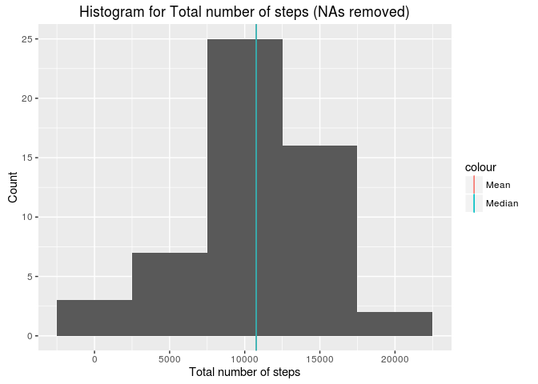
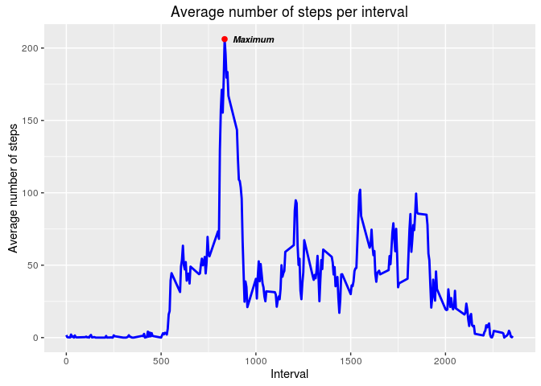
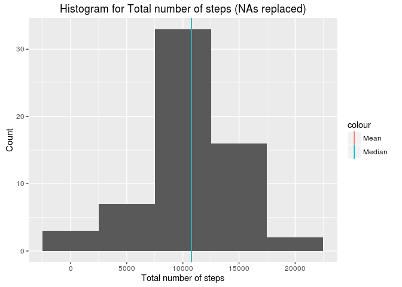
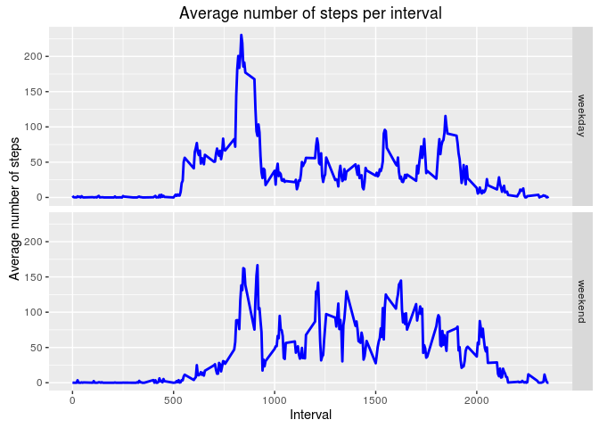

Loading and preprocessing the data
----------------------------------

First, define the working directory:

    setwd("/home/maria/R/Course 5 - Reproducible Research/Week 2/Assignment/")

Then, load the data:

    activity <- read.csv("activity.csv")

Load library ggplot2:

    library(ggplot2)

What is mean total number of steps taken per day?
-------------------------------------------------

Make a histogram of the total number of steps taken each day. For this
part of the assignment, you can ignore the missing values in the
dataset.

    activity<-activity[complete.cases(activity),]
    sum_steps <- aggregate(x = activity$steps, by=list(activity$date), FUN=sum)
    plot<-qplot(sum_steps$x,geom="histogram",binwidth=5000, main = "Histogram for Total number of steps (NAs removed)", xlab="Total number of steps", ylab="Count")+ geom_vline(data=sum_steps, aes(xintercept = mean(x),color="Mean"))+ geom_vline(data=sum_steps, aes(xintercept = median(x),color="Median"))
    print(plot)

Calculate and report the mean and median of the total number of steps
taken per day:

    mean(sum_steps$x)

    ## [1] 10766.19

    median(sum_steps$x)

    ## [1] 10765

As one can see, the above values are very close, hence the Mean vertical
line in the chart does not appear.

What is the average daily activity pattern?
-------------------------------------------

Make a time series plot (i.e. type = "l") of the 5-minute interval
(x-axis) and the average number of steps taken, averaged across all days
(y-axis):

    activity <- read.csv("activity.csv")
    mean_steps_interval <- aggregate(x = activity$steps, by=list(Interval=activity$interval), FUN=mean, na.rm=T)
    max<-mean_steps_interval[which.max(mean_steps_interval$x),]
    #type="l" means that the plot is a line
    plot<-ggplot(mean_steps_interval, aes(x=Interval, y=x))+ geom_line(lwd=1,colour="blue")+ annotate("point", x=max$Interval, y=max$x, size=2,colour="red")+ annotate("text", label="Maximum", x=max$Interval+150, y=max$x, size=3, fontface="bold.italic")+ ylab("Average number of steps")+ ggtitle("Average number of steps per interval")
    print(plot)

Which 5-minute interval, on average across all the days in the dataset,
contains the maximum number of steps?

    mean_steps_interval[which.max(mean_steps_interval$x),]

    ##     Interval        x
    ## 104      835 206.1698

Imputing missing values
-----------------------

Calculate and report the total number of missing values in the dataset
(i.e. the total number of rows with NAs):

    activity <- read.csv("activity.csv")
    sum(is.na(activity$steps))+ sum(is.na(activity$date))+ sum(is.na(activity$interval))

    ## [1] 2304

Devise a strategy for filling in all of the missing values in the
dataset. The strategy does not need to be sophisticated. Create a new
dataset that is equal to the original dataset but with the missing data
filled in.

I decided to use the mean for every 5-minute interval:

    replace<-data.frame(steps=0,date=0,interval=0)

    for (int in unique(activity$interval)){
      replace_NA<-subset(activity,interval==int)
      #print(summary(replace_NA$steps))
      replace_NA[is.na(replace_NA$steps),1]<-mean(replace_NA$steps, na.rm=T)
      #print(summary(replace_NA$steps))
      
      replace<-rbind(replace,replace_NA)
    }
    replace<-replace[-1,]
    sum_steps <- aggregate(x = replace$steps, by=list(Date=replace$date), FUN=sum)

Make a histogram of the total number of steps taken each day:

    plot<-qplot(sum_steps$x,geom="histogram", binwidth=5000, main = "Histogram for Total number of steps (NAs replaced)", xlab="Total number of steps", ylab="Count")+ geom_vline(data=sum_steps, aes(xintercept = mean(x),color="Mean"))+ geom_vline(data=sum_steps, aes(xintercept = median(x),color="Median"))
    print(plot)

 Calculate and
report the mean and median total number of steps taken per day. Do these
values differ from the estimates from the first part of the assignment?
What is the impact of imputing missing data on the estimates of the
total daily number of steps?

    mean(sum_steps$x)

    ## [1] 10766.19

    median(sum_steps$x)

    ## [1] 10766.19

The median values differ slightly. These values are basically the same
because I added the mean values, therefore not significantly impacting
the overall results.

One can note that the mean and median values are the same, hence we con
only see one line in the chart.

Are there differences in activity patterns between weekdays and weekends?
-------------------------------------------------------------------------

Use the dataset with the filled-in missing values for this part. Create
a new factor variable in the dataset with two levels – “weekday” and
“weekend” indicating whether a given date is a weekday or weekend day.

    replace$day<-ifelse(weekdays(as.Date(as.character(replace$date))) %in% c("sábado", "domingo"), "weekend", "weekday")
    table(replace$day)

    ## 
    ## weekday weekend 
    ##   12960    4608

Make a panel plot containing a time series plot (i.e. type = "l") of the
5-minute interval (x-axis) and the average number of steps taken,
averaged across all weekday days or weekend days (y-axis).

    mean_steps_interval <- aggregate(x = replace$steps, by=list(replace$interval,replace$day), FUN=mean)
    names(mean_steps_interval)<-c("interval","day","steps")
    plot<-ggplot(mean_steps_interval, aes(x=interval, y=steps))+ geom_line(lwd=1,colour="blue")+ facet_grid(day~.)+ xlab("Interval") + ylab("Average number of steps")+ ggtitle("Average number of steps per interval")
    print(plot)

